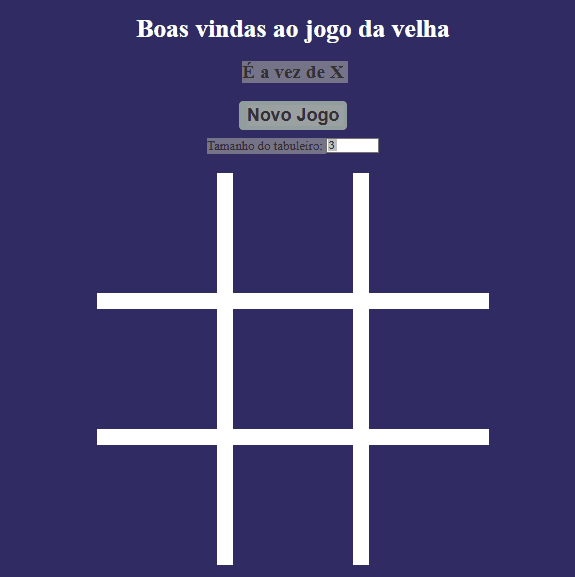
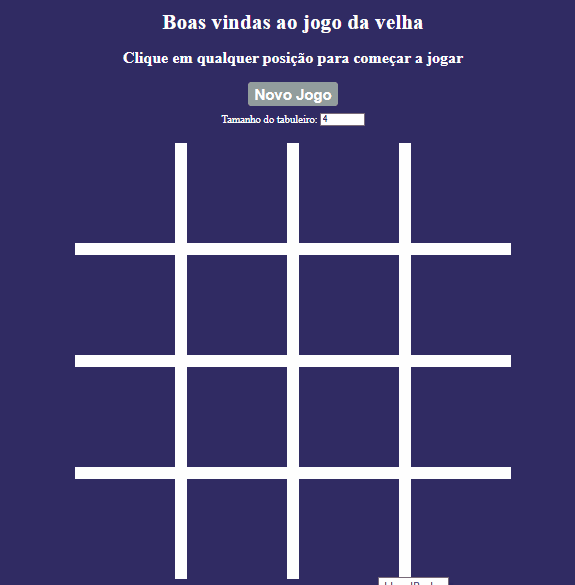
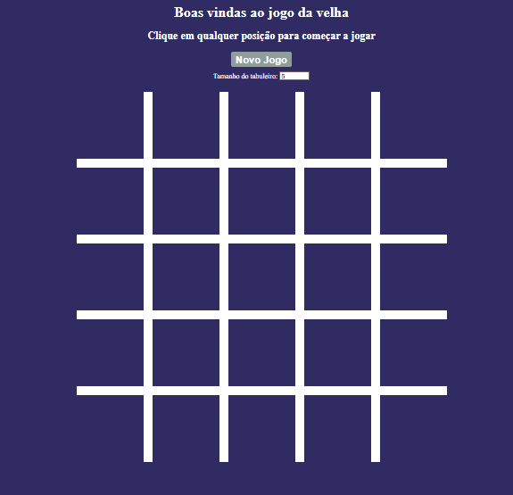
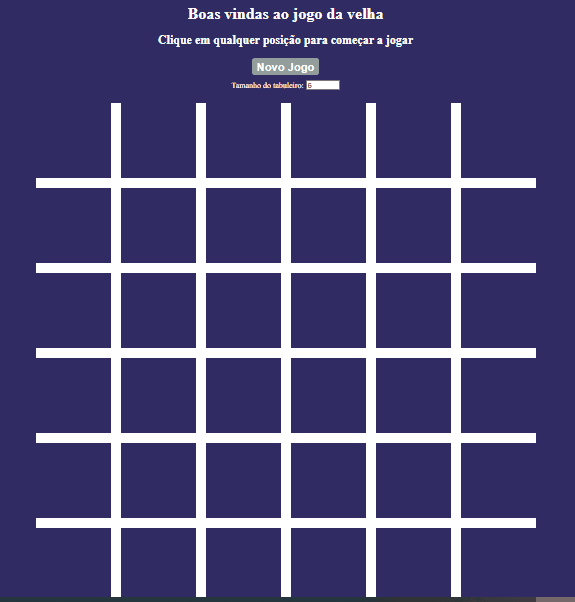

# 🎮 Jogo da Velha Avançado ♟️

## 🤔 O que é este projeto 
Este é um projeto interativo de Jogo da Velha desenvolvido com foco em HTML5, CSS3 e JaScript, como parte do curso de Formação Front-End.

## 💎 Demonstração 

<table align="center">
<tr>      
<td align="center"><br>Tabuleiro 3x3</img></td>
<td align="center"><br>Tabuleiro 4x4</img></td>
<td align="center"><br>Tabuleiro 5x5</img></td>
<td align="center"><br>Tabuleiro 6x6</img></td>
</tr>
</table>

## 💡 Sobre o projeto

- O jogo pode ser iniciado com **formato personalizado**, variando entre **3 a 7 colunas/linhas**.
- A partida ocorre entre **dois jogadores humanos**, alternando símbolos (X e O).
- Ao final do jogo, o sistema indica se houve **vitória ou empate**.

> O reinício da partida é feito de forma **manual**, e o jogo **não mantém placar entre rodadas**.

## ⚙️ Tecnologias utilizadas


## 📦 Como Executar o Projeto

1. **Clone o repositório**
```
   git clone https://github.com/barbaradantas030/jogo-da-velha.git
```

## 💻 Como utilizar

1. Abra o arquivo `index.html` em seu navegador.
2. Escolha o tamanho do tabuleiro.
3. Jogue alternadamente clicando nas células.
4. O resultado será exibido após a vitória ou empate.

## ⭐ Sobre Mim
Sou Bárbara Dantas, profissional em transição de carreira com mais de 10 anos de experiência em gestão e educação. Atualmente estudo Desenvolvimento Web com foco em front-end (HTML, CSS, JavaScript) e busco minha primeira oportunidade como desenvolvedora júnior ou estagiária.

## 📌 Observações

Este projeto foi desenvolvido durante o curso **Formação DEV** da **COD3R**, com orientação da professora **Letícia Garcez**.  
Serve como prática de lógica de programação, manipulação de arrays e controle de estado de interface.

----------

<p align="center">Feito com 💗 por Bárbara e Profª Letícia Garcez (Cod3r).</p>

